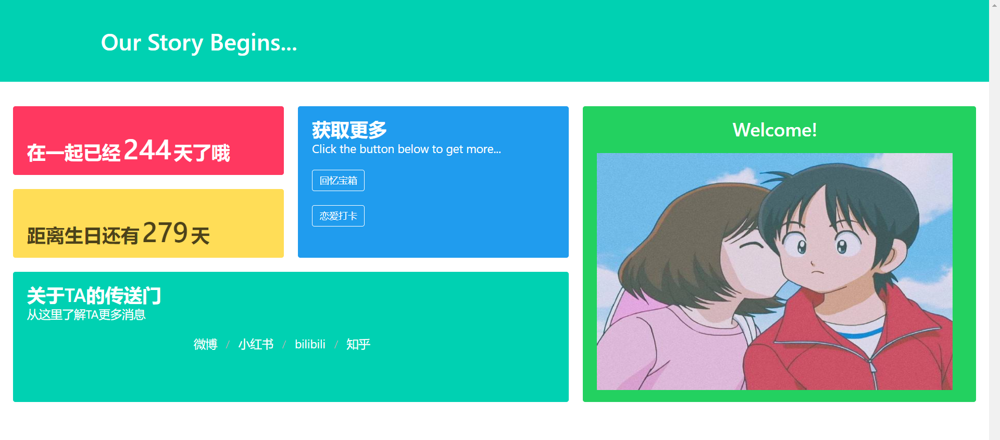
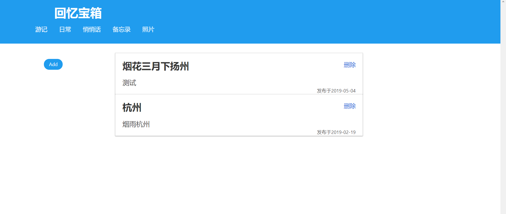
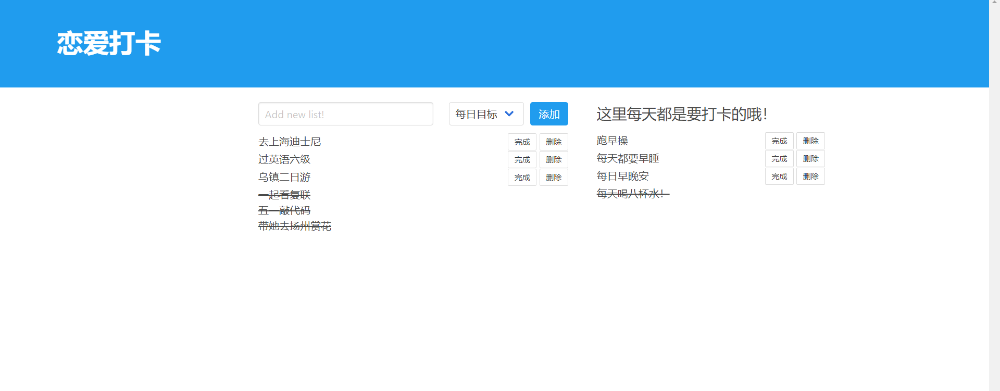

### Our Story

 1. 用Java语言实现几个功能的后端，使用SpringBoot框架，以及Thymeleaf框架进行渲染，用MyBatis进行数据的操作，存储到本地数据库，前端部分的话主要是用已经写好的css库来美化
 2. 
这是主界面，显示比较重要的纪念日，然后添加了传送门，可以传送到他的主页，较快获取他的消息
中间部分可以去查看回忆，以及打卡 (里面有个bug 改不出来了，接口就没有接上去)

 3. 
回忆宝箱，我设置好了分类，可以分类别查看 

4. 

   这部分是可以打卡的，分作每日打卡，以及长期目标的打卡